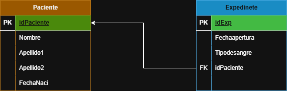
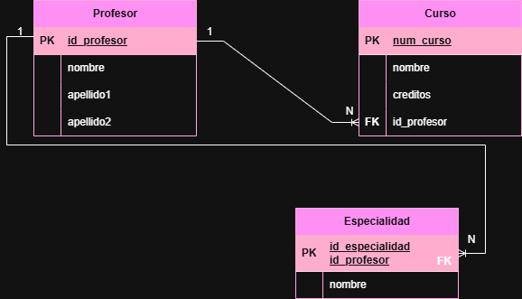
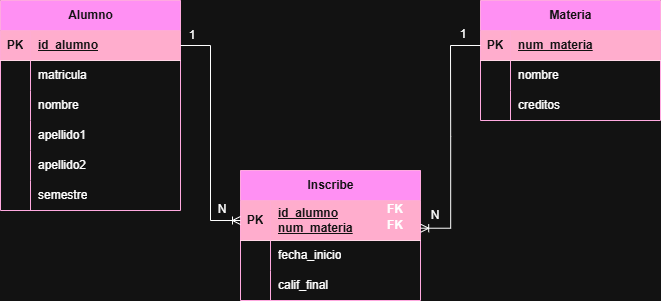
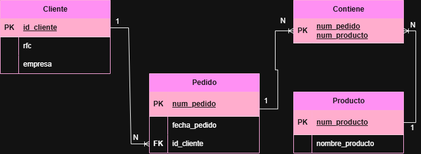

# Ejercicios del Modelo Relacional

## Ejercicio 1

### Modelo E-R

### Modelo Relacional

## Ejercicio 2

### Modelo E-R

### Modelo Relacional

## Ejercicio 3

### Modelo E-R

### Modelo Relacional

## Ejercicio 4

### Modelo E-R

### Modelo Relacional

## Ejercicio 5
### Modelo E-R

### Modelo Relacional

## Ejercicio 6
### Modelo E-R

### Modelo Relacional

## Ejercicio 7
### Modelo E-R

### Modelo Relacional
